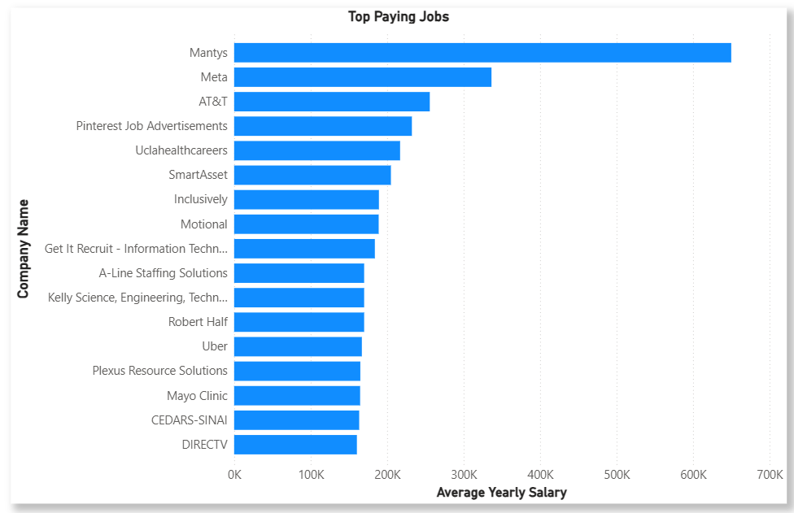
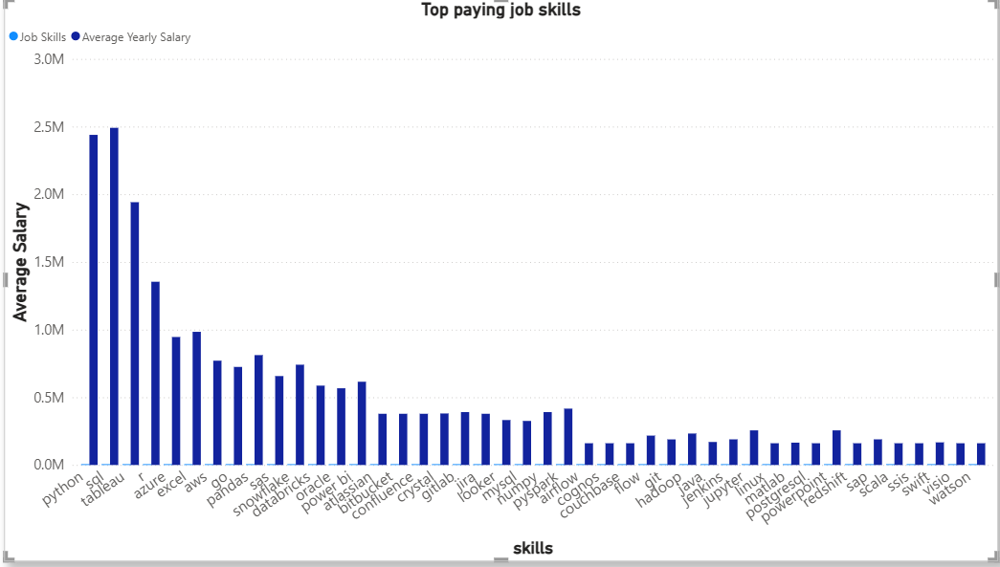
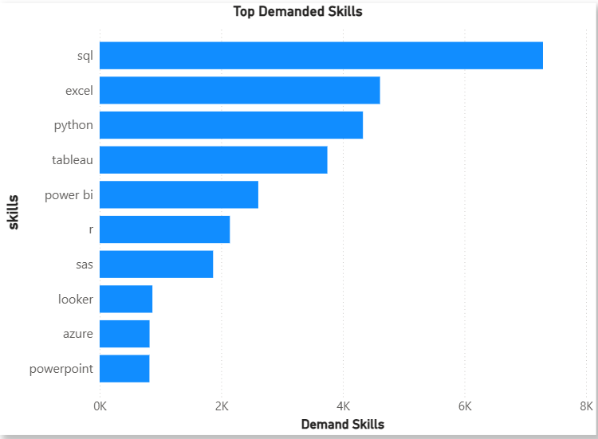
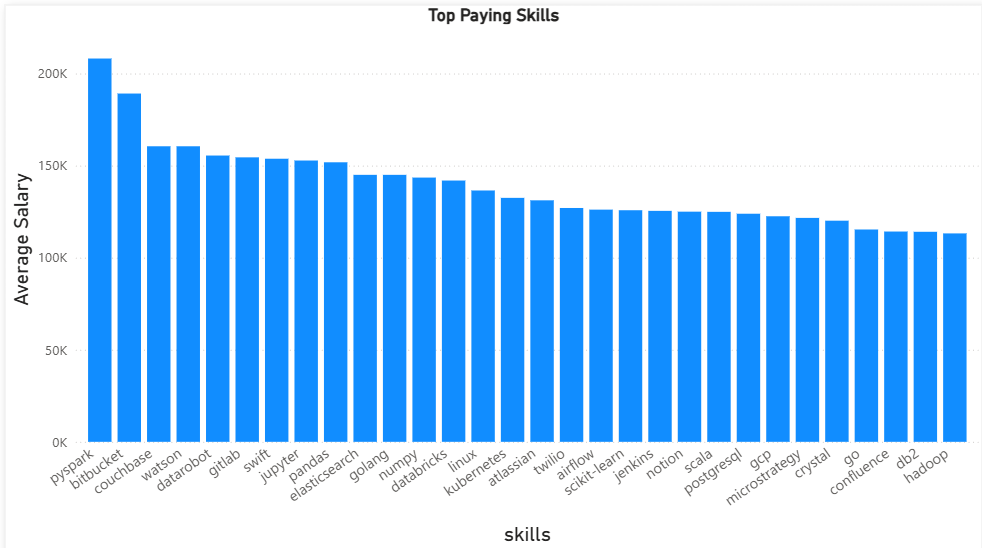
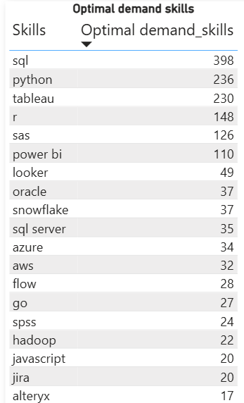

# Introduction
📊 This project analyzes the data analytics job market to uncover top-paying roles, most in-demand skills, and the sweet spot where high demand meets high salary. Using data-driven insights from job postings, it helps aspiring and professional data analysts make smarter career and skill-development decisions.

SQL queries are below here: [project folder](/project/) 

# Background
The rapid growth of data-driven decision-making across industries has increased the demand for skilled data analysts. However, not all roles and skills offer the same career value. This project was developed to bridge that gap by examining job market data to highlight which data analytics jobs pay the most, which skills employers demand most, and where strong demand aligns with higher salaries, providing practical guidance for career planning and upskilling.

The dataset is gotten from (https://lukebarousse.com/sql). It is rich in insights covering job roles, pay levels, locations, and core skill requirements.

### The project questions are as follows:
1. What are the top paying data analyst jobs?
2. What are the required skills for the top paying jobs?
3. What are the most in demand skills for data analysts?
4. What are the skills associated with a higher salary?
5. What are the most optimal skills to learn as a data analyst?  

# Tools Used
To successfully analyze the data analytics job market and produce reliable insights, this project leverages a set of essential tools that support data querying, management, development, and version control. Each tool plays a specific role in ensuring the analysis is efficient, accurate, and well-documented.

- **SQL**: Used to write queries for data extraction, cleaning, and analysis, enabling the identification of top-paying roles, in-demand skills, and salary trends in data analytics.
- **PostgreSQL**: Served as the database management system for storing and managing large job market datasets, ensuring efficient querying and reliable data handling.
- **Visual Studio Code (VS Code)**: Used as the primary development environment for writing, organizing, and executing SQL queries with ease and consistency.
- **Git & GitHub:** Enabled version control, project tracking, and collaboration, while also serving as a platform to document and showcase the project as part of a professional data analytics portfolio.

# Analysis
The analysis focuses on exploring data analytics job postings to uncover patterns in salaries, job roles, and skill requirements. By querying and aggregating the data, the project identifies the highest-paying positions, the most sought-after technical skills, and the overlap between strong market demand and higher compensation. The findings provide clear, data-driven insights into current industry trends, helping guide career decisions and skill development for data analytics professionals.

### 1. The Top Paying Data Analyst Jobs
To identify the highest-paying Data Analyst roles, I queried the job postings dataset to focus on Data Analyst positions available anywhere with reported salaries. The query joins the job postings with company information to include the company name, filters out entries without salary data, and orders the results from highest to lowest average yearly salary. Finally, it limits the output to the top 20 results, providing a clear snapshot of the most lucrative opportunities.

```sql
SELECT 
    job_id,
    job_title_short,
    job_location,
    job_schedule_type,
    job_posted_date,
    salary_year_avg,
    name AS company_name
FROM job_postings_fact
LEFT JOIN company_dim ON job_postings_fact.company_id = company_dim.company_id
WHERE
    job_title_short = 'Data Analyst' AND
    job_location = 'Anywhere' AND
    salary_year_avg IS NOT NULL
ORDER BY
    salary_year_avg DESC
LIMIT 20
```

*The chart visualise the salary for the top 20 salaries for data analyst; I used Microsoft Power BI to get the visuals from my SQL query results*

### 2. Top Paying Job Skills
This query first selects the top 20 highest-paying Data Analyst jobs available anywhere, including the company name and average yearly salary. Using a Common Table Expression (CTE), it isolates these top-paying roles, then joins with skill-related tables to retrieve the specific skills required for each position. The final result provides a clear list of high-paying jobs along with the key skills needed, ordered from highest to lowest salary.

This demonstrates not only the roles that pay the most but also highlights the skills that make candidates competitive for these positions.
```sql
WITH top_paying_jobs AS (
    SELECT 
        job_id,
        job_title_short,
        salary_year_avg,
        name AS company_name
    FROM job_postings_fact
    LEFT JOIN company_dim ON job_postings_fact.company_id = company_dim.company_id
    WHERE
        job_title_short = 'Data Analyst' AND
        job_location = 'Anywhere' AND
        salary_year_avg IS NOT NULL
    ORDER BY
        salary_year_avg DESC
    LIMIT 20
)
SELECT 
    top_paying_jobs.*,
    skills
FROM
    top_paying_jobs

INNER JOIN skills_job_dim ON top_paying_jobs.job_id = skills_job_dim.job_id
INNER JOIN skills_dim ON skills_job_dim.skill_id = skills_dim.skill_id
ORDER BY
    salary_year_avg DESC
```

The chart visualises the top paying job skills

### 3.Top Skills in Demand
This query analyzes all Data Analyst job postings to determine which skills are most frequently requested. It joins the job postings with skill-related tables to link each job to its required skills. By counting how often each skill appears and ordering them in descending order, the query highlights the top 10 most in-demand skills, specifically focusing on remote-friendly roles. This helps understand which skills are most valued in the current job market for Data Analysts.
```sql
SELECT 
    skills,
    COUNT(skills_job_dim.job_id) AS demand_skills
FROM
    job_postings_fact
INNER JOIN skills_job_dim ON job_postings_fact.job_id = skills_job_dim.job_id
INNER JOIN skills_dim ON skills_job_dim.skill_id = skills_dim.skill_id
WHERE
    job_title_short = 'Data Analyst' AND
    job_work_from_home = True
GROUP BY
    skills
ORDER BY
    demand_skills DESC
LIMIT 10
```

This chart shows the top demanded skills needed for data analystics role

### 4. Top Paying Skills
This query examines Data Analyst roles with specified salaries to determine which skills are associated with higher pay. By joining job postings with skill tables, it calculates the average salary for each skill. The results are then ranked from highest to lowest average salary, highlighting the top 30 skills that command better compensation, with a focus on remote-friendly positions. This helps identify which skills not only are in demand but also contribute most to higher earnings.

```sql
SELECT 
    skills,
    ROUND(AVG(salary_year_avg), 0) AS avg_salary
FROM
    job_postings_fact
INNER JOIN skills_job_dim ON job_postings_fact.job_id = skills_job_dim.job_id
INNER JOIN skills_dim ON skills_job_dim.skill_id = skills_dim.skill_id
WHERE
    job_title_short = 'Data Analyst' AND
    job_work_from_home = True AND
    salary_year_avg IS NOT NULL
GROUP BY
    skills
ORDER BY
    avg_salary DESC
LIMIT 30
```

The chart shows the roles that are being paid the most

### 5. Optimal Skills
This query combines demand and salary data to highlight the most valuable skills for Data Analyst roles. It first calculates how often each skill appears in remote-friendly positions with specified salaries and then computes the average salary associated with each skill. By focusing on skills that are both highly sought after and linked to higher pay, the final results identify the top 30 optimal skills for career growth, ranked by average salary and demand. This provides a clear roadmap for which skills to prioritize when aiming for high-paying, in-demand roles.

```sql
WITH skills_demand AS (
    SELECT 
        skills_dim.skill_id,
        skills_dim.skills,
        COUNT(skills_job_dim.job_id) AS demand_skills
    FROM
        job_postings_fact
    INNER JOIN skills_job_dim ON job_postings_fact.job_id = skills_job_dim.job_id
    INNER JOIN skills_dim ON skills_job_dim.skill_id = skills_dim.skill_id
    WHERE
        job_title_short = 'Data Analyst' AND
        salary_year_avg IS NOT NULL AND
        job_work_from_home = True
    GROUP BY
        skills_dim.skill_id
), average_salary AS (
    SELECT 
        skills_job_dim.skill_id,
        ROUND(AVG(salary_year_avg), 0) AS avg_salary
    FROM
        job_postings_fact
    INNER JOIN skills_job_dim ON job_postings_fact.job_id = skills_job_dim.job_id
    INNER JOIN skills_dim ON skills_job_dim.skill_id = skills_dim.skill_id
    WHERE
        job_title_short = 'Data Analyst' AND
        job_work_from_home = True AND
        salary_year_avg IS NOT NULL
    GROUP BY
        skills_job_dim.skill_id
)    

SELECT
    skills_dim.skill_id,
    skills_dim.skills,
    COUNT(skills_job_dim.job_id) AS demand_skills,
    ROUND(AVG(job_postings_fact.salary_year_avg), 0) AS avg_salary
FROM
    job_postings_fact
INNER JOIN skills_job_dim ON job_postings_fact.job_id = skills_job_dim.job_id
INNER JOIN skills_dim ON skills_job_dim.skill_id = skills_dim.skill_id
WHERE
    job_title_short ='Data Analyst' AND
    salary_year_avg IS NOT NULL AND
    job_work_from_home = True 
GROUP BY
    skills_dim.skill_id
HAVING
    COUNT(skills_job_dim.job_id) > 10
ORDER BY
    avg_salary DESC,
    demand_skills DESC
LIMIT 30
```

# Insight
1. **Top Paying Data Analyst Jobs**: The highest paying remote jobs for data analyst is at $650,000!
2. **Top paying Job Skills**: It shows that proficiency in SQL attracts a high salary as a data analyst.

3. **Top Demanded Skills**: It also shows that SQL is also the most demanded skill as a data analyst in the industry.
4. **Top Paying Skills**: SVN and Solidity are associated as highest average salaries as specialized skills, indicating a premium on niche expertise.
5. **Optimal Skills**: SQL also leads in demand and offer a high average salary, positioning it as one of the most optimal skills for data analysts.

